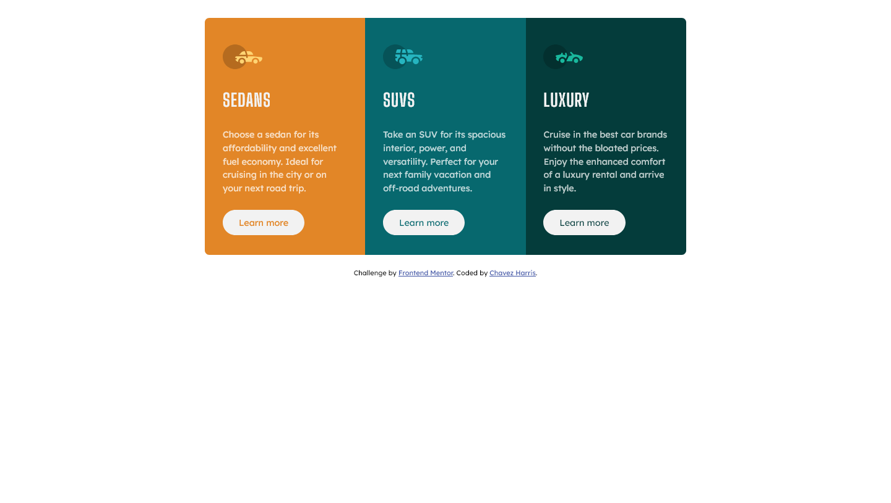
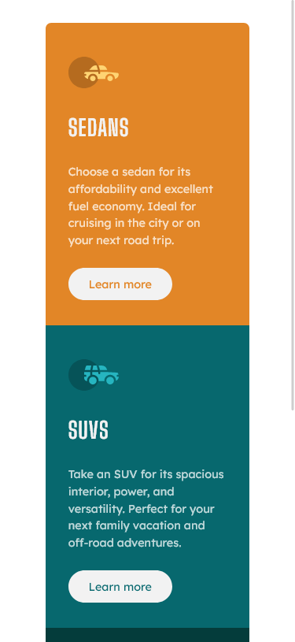

# Frontend Mentor - 3-column preview card component solution

This is a solution to the [3-column preview card component challenge on Frontend Mentor](https://www.frontendmentor.io/challenges/3column-preview-card-component-pH92eAR2-). Frontend Mentor challenges help you improve your coding skills by building realistic projects. 

## Table of contents

- [Overview](#overview)
  - [The challenge](#the-challenge)
  - [Screenshot](#screenshot)
  - [Links](#links)
- [My process](#my-process)
  - [Built with](#built-with)
  - [What I learned](#what-i-learned)
  - [Continued development](#continued-development)
  - [Useful resources](#useful-resources)
- [Author](#author)
- [Acknowledgments](#acknowledgments)

**Note: Delete this note and update the table of contents based on what sections you keep.**

## Overview

### The challenge

Users should be able to:

- View the optimal layout depending on their device's screen size
- See hover states for interactive elements

### Screenshots

#### Desktop



#### Desktop



### Links

- Solution URL: [Add solution URL here](https://your-solution-url.com)
- Live Site URL: [Add live site URL here](https://your-live-site-url.com)

## My process

### Built with

- Semantic HTML5 markup
- CSS custom properties
- Flexbox
- Mobile-first workflow

**Note: These are just examples. Delete this note and replace the list above with your own choices**

### What I learned

I learnt how to use Flexbox to lay components out a bit better. I placed everything inside a container with a max-width of 90% to prevent the components from touching the edges. 

I then used a flex row within the container to layout the child elements.

See below:

```html
 <div class="container">
      <div class="row">
        <div class="col col--one">
          <!-- ... -->
        </div>

        <div class="col col--two">
          <!-- ... -->
        </div>

        <div class="col col--three">
          <!-- ... -->
      </div>
    </div>
```
```css
.container {
  width: 90%;
  margin: 0 auto;
}

.row {
  display: flex;
  flex-wrap: wrap;
  justify-content: center;
}
```

### Continued development

I plan to pickup a an entire book on Flexbox jut to get better at this stuff

### Useful resources

- [Conquering Responsive Layouts](https://courses.kevinpowell.co/view/courses/conquering-responsive-layouts) - This helped me understand flexbox better. I really liked this pattern and will use it going forward.

## Author

- Website - [Chavez Harris](https://www.codedbychavez.com)
- Frontend Mentor - [@codedbychavez](https://www.frontendmentor.io/profile/yourusername)

## Acknowledgments

Hats off to Frontend mentor for making this challenge possible and its amazing community <3.

